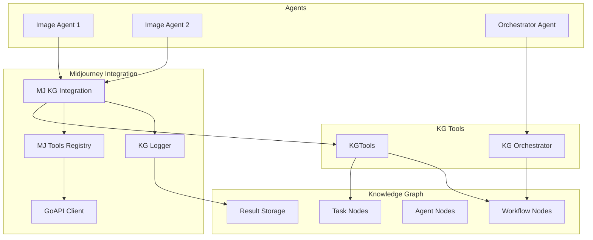

# KG Tools + Midjourney Integration Guide

## Overview

This guide demonstrates how the Knowledge Graph (KG) tools integrate with the Midjourney image generation system to create a powerful, orchestrated workflow for image generation tasks.

## Key Integration Points

### 1. Task-Based Image Generation

The KG tools enable creating image generation tasks that can be:
- Discovered by specialized agents
- Claimed and processed asynchronously  
- Tracked through completion
- Analyzed for patterns and optimization

### 2. Workflow Orchestration

Complex image projects can be orchestrated as workflows:
- Multi-step image generation pipelines
- Book illustration projects
- Product image campaigns
- Parallel and sequential processing

### 3. Agent Coordination

Multiple agents can collaborate on image generation:
- Task distribution based on capabilities
- Load balancing across agents
- Result sharing through the KG
- Performance tracking and analytics

## Architecture



## Usage Examples

### Creating Image Generation Tasks

```python
from kg.models.graph_manager import KnowledgeGraphManager
from semant.agent_tools.midjourney.kg_integration import MidjourneyKGIntegration

# Initialize
kg = KnowledgeGraphManager(persistent_storage=True)
await kg.initialize()

integration = MidjourneyKGIntegration(kg, "my_agent")

# Create a single image task
task_id = await integration.create_image_task(
    prompt="futuristic city skyline, cyberpunk aesthetic",
    task_name="Hero Banner",
    version="v7",
    aspect_ratio="16:9",
    priority="high"
)

# Process the task
result = await integration.process_image_task(task_id)
print(f"Generated image: {result['result']['image_url']}")
```

### Creating Image Workflows

```python
from agents.domain.kg_orchestrator_agent import KGOrchestratorAgent

# Create orchestrator
orchestrator = KGOrchestratorAgent("image_orchestrator")
orchestrator.knowledge_graph = kg
await orchestrator.initialize()

# Define a product image workflow
workflow_msg = AgentMessage(
    sender_id="planner",
    message_type="create_workflow",
    content={
        "name": "Product Launch Images",
        "type": "parallel",
        "steps": [
            {
                "name": "Product Hero Shot",
                "type": "image_generation",
                "metadata": {
                    "prompt": "sleek smartphone on white background",
                    "version": "v7",
                    "aspect_ratio": "1:1"
                }
            },
            {
                "name": "Lifestyle Image",
                "type": "image_generation",
                "metadata": {
                    "prompt": "person using smartphone in cafe",
                    "version": "v7",
                    "aspect_ratio": "16:9"
                }
            },
            {
                "name": "Feature Highlight",
                "type": "image_generation",
                "metadata": {
                    "prompt": "smartphone screen with app interface",
                    "version": "v7",
                    "aspect_ratio": "9:16"
                }
            }
        ]
    }
)

response = await orchestrator.process_message(workflow_msg)
workflow_id = response.content['workflow_id']
```

### Book Generation Workflow

```python
# Create a book illustration workflow
book_workflow_id = await integration.create_book_workflow(
    title="The Adventure Story",
    pages=[
        {
            "title": "Chapter 1: The Beginning",
            "text": "Once upon a time in a magical forest...",
            "prompt": "magical forest with glowing trees, children's book style"
        },
        {
            "title": "Chapter 2: The Journey",
            "text": "The hero set off on an adventure...",
            "prompt": "young hero on a winding path, adventure, illustration"
        },
        {
            "title": "Chapter 3: The Discovery",
            "text": "They found a hidden treasure...",
            "prompt": "treasure chest in cave, magical glow, storybook art"
        }
    ]
)

# Get generated images for the book
images = await integration.get_workflow_images(book_workflow_id)
for img in images:
    print(f"Page: {img['name']}")
    print(f"Image: {img['image_url']}")
```

### Multi-Agent Processing

```python
# Create multiple image agents
agents = []
for i in range(3):
    agent = MidjourneyKGAgent(f"image_agent_{i}")
    agent.knowledge_graph = kg
    await agent.initialize()
    agents.append(agent)

# Agents automatically discover and process tasks
for agent in agents:
    # Start work loop (runs continuously)
    asyncio.create_task(agent.work_loop())

# Create batch of tasks
for prompt in ["logo design", "banner image", "icon set"]:
    await integration.create_image_task(
        prompt=f"modern {prompt}, minimalist style",
        priority="medium"
    )

# Agents will automatically claim and process tasks
```

### Querying Generation History

```python
# Get recent generations
history = await integration.query_generation_history(
    limit=10,
    status="completed"
)

for record in history:
    print(f"Task: {record['name']}")
    print(f"Status: {record['status']}")
    metadata = record.get('metadata', {})
    print(f"Prompt: {metadata.get('prompt')}")
    print("---")

# Analyze patterns
analysis = await integration.analyze_generation_patterns()
print(f"Total tasks: {analysis['total_tasks']}")
print(f"Success rate: {analysis['success_rate']}")
print(f"Top agents: {analysis['top_agents']}")
```

### SPARQL Queries for Analytics

```python
# Find all images generated for a specific project
query = """
PREFIX core: <http://example.org/core#>
SELECT ?task ?prompt ?image WHERE {
    ?workflow core:workflowName "Product Launch Images" ;
              core:hasTask ?task .
    ?task core:metadata ?metadata ;
          core:result ?result ;
          core:status "completed" .
    FILTER(CONTAINS(?metadata, '"prompt"'))
}
"""

results = await kg.query_graph(query)

# Agent performance metrics
perf_query = """
PREFIX core: <http://example.org/core#>
SELECT ?agent 
       (COUNT(?task) as ?total)
       (AVG(?duration) as ?avg_time) WHERE {
    ?task core:assignedTo ?agent ;
          core:taskType "image_generation" ;
          core:status "completed" .
    # Calculate duration if timestamps available
}
GROUP BY ?agent
ORDER BY DESC(?total)
"""
```

## Integration Components

### MidjourneyKGIntegration Class

Located in `semant/agent_tools/midjourney/kg_integration.py`

Key methods:
- `create_image_task()` - Create image generation tasks
- `create_book_workflow()` - Create book illustration workflows
- `process_image_task()` - Process a task using MJ tools
- `query_generation_history()` - Get generation history
- `analyze_generation_patterns()` - Analyze usage patterns

### MidjourneyKGAgent Class

Located in demo script, can be adapted for production use.

Features:
- Automatic task discovery
- Midjourney tool execution
- Result storage in KG
- Continuous work loop

### KG Logger Integration

The existing `KGLogger` from Midjourney tools is used to:
- Log all tool invocations
- Store prompts and results
- Track agent performance
- Enable traceability

## Benefits

### 1. Decentralized Processing
- No central coordinator needed
- Agents independently discover work
- Automatic load balancing

### 2. Persistent State
- All tasks stored in KG
- Complete history available
- Queryable via SPARQL

### 3. Workflow Orchestration
- Complex multi-step projects
- Dependency management
- Progress tracking

### 4. Analytics & Optimization
- Performance metrics
- Pattern analysis
- Resource optimization

### 5. Scalability
- Add agents dynamically
- Parallel processing
- Fault tolerance

## Configuration

### Environment Variables

```bash
# Required for real image generation
export MIDJOURNEY_API_TOKEN="your_token"

# Optional for GCS storage
export GCS_BUCKET_NAME="your_bucket"
export GOOGLE_APPLICATION_CREDENTIALS="path/to/credentials.json"
```

### KG Configuration

The KG can be configured for:
- Local RDF storage (default)
- Remote SPARQL endpoint
- Persistent file storage

## Testing

Run the demonstration:

```bash
# Full integration demo
python scripts/demo_kg_midjourney_integration.py

# With real Midjourney (requires token)
MIDJOURNEY_API_TOKEN="your_token" python scripts/demo_kg_midjourney_integration.py
```

## Production Deployment

1. **Initialize KG**: Set up persistent KG storage
2. **Deploy Agents**: Start multiple MidjourneyKGAgent instances
3. **Create Tasks**: Use orchestrator or direct API
4. **Monitor Progress**: Query KG for status
5. **Analyze Results**: Use SPARQL for analytics

## Troubleshooting

### Common Issues

1. **Tasks not being processed**
   - Check agent capabilities match task requirements
   - Verify agents are running work loops
   - Check KG connectivity

2. **Midjourney errors**
   - Verify API token is set
   - Check version compatibility (v6 vs v7)
   - Review rate limits

3. **KG query issues**
   - Ensure namespaces are correct
   - Verify RDF triples are properly formatted
   - Check SPARQL syntax

## Next Steps

1. **Production Agent Deployment**
   - Create dedicated MidjourneyKGAgent service
   - Add monitoring and alerting
   - Implement retry logic

2. **Advanced Workflows**
   - Conditional branching
   - Dynamic task generation
   - Cross-workflow dependencies

3. **Enhanced Analytics**
   - Cost tracking
   - Quality metrics
   - Optimization recommendations

## Conclusion

The integration of KG tools with Midjourney creates a powerful system for orchestrated image generation. Tasks can be created, distributed, processed, and analyzed through the knowledge graph, enabling sophisticated multi-agent workflows and comprehensive analytics.
