## Test Suite Integration & Migration Notes

> 📌  **Reminder:** Follow the "2035 Agent Recovery Hotfix Protocol" in `docs/developer_guide.md` for any changes touching recovery logic.

> **2025-06-24 Update:** Core agent layer now auto-binds RDF prefixes (`core:`, `agent:`, `rdf:`) and writes status/metric triples in CamelCase (`core:hasMessageCount`, `core:hasStatus`).  `query_knowledge_graph()` accepts raw SPARQL and returns `list[dict]`, unblocking all performance tests.

### Common Pitfalls and Solutions

#### 1. Async Agent Capability Access
- **Always** use `await agent.get_capabilities()` to access agent capabilities.
- **Never** use direct attribute access (`agent.capabilities`) or `await agent.capabilities` (deprecated and may cause errors).
- If you see `TypeError: object set can't be used in 'await' expression`, check for deprecated usage.

#### 2. JSON Serialization of Sets
- Python's `json.dumps` does **not** support serializing `set` objects.
- **Always** convert sets to lists before serializing objects (e.g., when saving workflows).
- If you see `TypeError: Object of type set is not JSON serializable`, check for set usage in workflow or agent data structures.

#### 3. Capability Type Naming
- Use only valid capability types as defined in `agents/core/capability_types.py`.
- If you see `AttributeError: SENSOR`, use `CapabilityType.SENSOR_DATA` or the correct enum value.

### Migration Notes for Test Authors
- Update all tests to use async capability access (`await agent.get_capabilities()`).
- Ensure all sets are converted to lists before serialization in test and production code.
- Validate all capability type references against the canonical enum.

### Example Fixes
```python
# Correct async capability access
capabilities = await agent.get_capabilities()

# Correct serialization
json.dumps(list(my_set))

# Correct capability type usage
cap = Capability(CapabilityType.SENSOR_DATA, "1.0")
```

### See also: agents/agents_readme.md for detailed async agent and capability management patterns.

## Knowledge Graph Architecture & Debugging

### Core Components

1. **KnowledgeGraphManager**
   - Central interface for graph operations
   - Handles initialization, queries, and validation
   - Manages metrics and performance monitoring

2. **Graph Operations**
   - Triple storage and retrieval
   - SPARQL query execution
   - Graph validation and rule enforcement
   - Performance metrics collection

### Debugging Architecture

#### 1. Diagnostic Components
```python
# Metrics tracking
print(f"Query count: {kg.metrics['query_count']}")
print(f"Cache hits: {kg.metrics['cache_hits']}")
print(f"Cache misses: {kg.metrics['cache_misses']}")

# Graph validation
validation_results = await kg.validate_graph()
```

#### 2. Data Verification Flow


### Common Architectural Patterns

1. **Triple Management**
   ```python
   await kg.add_triple(
       subject="http://example.org/agent/EmailProcessor",
       predicate="http://example.org/core#hasCapability",
       object="http://example.org/capability/ProcessEmails"
   )
   ```

2. **Query Patterns**
   ```python
   # Standard query pattern
   query = """
   SELECT ?subject ?predicate ?object
   WHERE {
       ?subject ?predicate ?object .
   }
   """
   results = await kg.query_graph(query)
   ```

3. **Validation Rules**
   ```python
   kg.add_validation_rule({
       "type": "required_property",
       "subject_type": "http://example.org/agent/Agent",
       "property": "http://example.org/core#hasCapability"
   })
   ```

### Performance Considerations

1. **Caching Strategy**
   - Query results caching
   - Pattern compilation caching
   - Configuration caching

2. **Resource Management**
   - Proper initialization/shutdown
   - Transaction management
   - Memory optimization

3. **Monitoring Points**
   - Query execution time
   - Cache utilization
   - Validation overhead
   - Graph size metrics

### See also: kg/kg_debug_example.py for detailed debugging patterns and examples.

# Technical Architecture

## Knowledge Graph System Architecture

### 1. Core Components

#### KnowledgeGraphManager
- Primary class for graph operations
- Handles caching, security, and versioning
- Implements SPARQL query interface
- Manages triple storage and indexing

#### GraphInitializer
- Handles ontology and data loading
- Manages schema validation
- Coordinates initialization sequence

#### RemoteGraphManager
- Provides SPARQL endpoint integration
- Handles distributed graph operations
- Manages remote query execution

### 2. Data Layer

#### Triple Storage
- Uses RDFlib for triple management
- Supports multiple serialization formats
- Implements efficient indexing

#### Cache System
- AsyncLRUCache with TTL support
- Selective invalidation logic
- Query result caching

#### Security Layer
- Role-based access control
- Audit logging
- Access rule validation

### 3. Query System

#### SPARQL Engine
- Full SPARQL 1.1 support
- Query optimization
- Result type conversion

#### Query Cache
- Query normalization
- Cache key management
- TTL-based invalidation

### 4. Ontology Structure

#### Core Ontology
- Domain concepts
- Relationship definitions
- Validation rules

#### Design Ontology
- Design patterns
- System architecture
- Component relationships

#### Agentic Ontology
- Agent capabilities
- Interaction patterns
- Coordination models

### 5. Performance Features

#### Indexing
- Triple pattern indexing
- Query path optimization
- Statistics tracking

#### Caching
- Multi-level cache
- Selective invalidation
- Performance metrics

#### Monitoring
- Query timing
- Cache statistics
- System metrics

### 6. Security Architecture

#### Access Control
- Role-based permissions
- Triple-level security
- Audit trail

#### Validation
- Schema validation
- Data consistency
- Security rules

### 7. Integration Points

#### API Layer
- REST endpoints
- GraphQL interface
- WebSocket support

#### Agent System
- Agent query interface
- Capability management
- Event handling

##### Work-Pack 07 – Sensor/DataProcessor Consolidation Diagram (added 2025-07-07)


### 8. Development Infrastructure

#### Testing Framework
- Comprehensive test suite
- Performance testing
- Security validation

#### Monitoring
- Metrics collection
- Performance tracking
- Error logging

#### Deployment
- Container support
- Configuration management
- Environment setup

### 9. System Requirements

#### Hardware
- Memory: 8GB minimum
- CPU: 4 cores recommended
- Storage: SSD preferred

#### Software
- Python 3.8+
- RDFlib
- SPARQL endpoint (optional)

#### Network
- Low latency for remote operations
- Secure connections
- Load balancing support

### 10. Scalability Features

#### Horizontal Scaling
- Distributed graph support
- Load balancing
- Replication

#### Vertical Scaling
- Memory optimization
- CPU utilization
- Storage efficiency

### 11. Maintenance

#### Backup
- Graph serialization
- Version control
- Data recovery

#### Monitoring
- Health checks
- Performance metrics
- Error tracking

#### Updates
- Schema migration
- Data validation
- Version management

## Agent Recovery System

### Overview
The agent recovery system is designed to handle agent failures and ensure system stability through automated recovery mechanisms. The system integrates with the knowledge graph to maintain state and track recovery attempts.

### Components

1. **Recovery Manager**
   - Handles recovery orchestration
   - Tracks recovery attempts
   - Manages recovery timeouts
   - Coordinates concurrent recovery

2. **State Management**
   - Uses knowledge graph for state persistence
   - Tracks agent status transitions
   - Maintains recovery metrics
   - Handles state rollback

3. **Recovery Strategies**
   - Retry-based recovery
   - Graceful degradation
   - State restoration
   - Resource cleanup

### Knowledge Graph Integration

1. **State Tracking**
   ```turtle
   @prefix agent: <http://example.org/agent/>
   @prefix core: <http://example.org/core#>
   
   agent:EmailProcessor
       core:hasStatus "idle" ;
       core:hasRecoveryAttempts "0" ;
       core:hasRecoveryStrategy "retry" ;
       core:hasMaxRecoveryAttempts "3" .
   ```

2. **Recovery Metrics**
   - Total attempts
   - Successful recoveries
   - Failed recoveries
   - Recovery duration

3. **State Validation**
   - Pre-recovery state checks
   - Post-recovery validation
   - Resource verification
   - Connection testing

### Recovery Process Flow

1. **Initialization**
   ```mermaid
   sequenceDiagram
       participant Agent
       participant RecoveryManager
       participant KnowledgeGraph
       
       Agent->>RecoveryManager: Initialize
       RecoveryManager->>KnowledgeGraph: Set Initial State
       KnowledgeGraph-->>RecoveryManager: Confirm
       RecoveryManager-->>Agent: Ready
   ```

2. **Recovery Sequence**
   ```mermaid
   sequenceDiagram
       participant Agent
       participant RecoveryManager
       participant KnowledgeGraph
       
       Agent->>RecoveryManager: Request Recovery
       RecoveryManager->>KnowledgeGraph: Check State
       KnowledgeGraph-->>RecoveryManager: Current State
       RecoveryManager->>Agent: Execute Recovery
       Agent-->>RecoveryManager: Recovery Result
       RecoveryManager->>KnowledgeGraph: Update State
   ```

### Error Handling

1. **Recovery Failures**
   - Maximum attempts exceeded
   - Timeout handling
   - Resource cleanup
   - State rollback

2. **Concurrent Recovery**
   - Lock management
   - Queue handling
   - Priority resolution
   - Deadlock prevention

### Monitoring & Metrics

1. **Performance Metrics**
   - Recovery success rate
   - Average recovery time
   - Resource usage
   - State transitions

2. **Health Checks**
   - Agent status monitoring
   - Resource availability
   - Connection status
   - System capacity

### Best Practices

1. **State Management**
   - Use atomic operations
   - Implement proper locking
   - Maintain audit trail
   - Handle edge cases

2. **Recovery Strategy**
   - Progressive backoff
   - Resource conservation
   - Graceful degradation
   - Circuit breaking

3. **Testing**
   - Unit tests
   - Integration tests
   - Load testing
   - Chaos testing

## Agent Recovery Architecture

### Lock Ordering Requirements

To prevent deadlocks, all agents MUST follow this strict lock acquisition order:

1. `_metrics_lock` (highest priority)
2. `_status_lock` (medium priority)
3. `_lock` (lowest priority)

Example usage:
```python
async with self._metrics_lock:      # Acquire first
    async with self._status_lock:   # Acquire second
        async with self._lock:      # Acquire last
            # Critical section
```

This ordering ensures deadlock-free operation when multiple agents are performing recovery operations simultaneously. 

## 🚀 2035 Salvage Roadmap – Message to Future Agents (added 2035-07-22)
See `docs/developer_guide.md` for the rationale behind these steps. Keep this section until full green build.

### Six-Step Debug Circuit (Quick Reference)
1. `pytest -q` – baseline failures & coverage
2. Root cause isolate with verbose logs
3. Impact scan (`grep`/semantic)
4. Apply atomic fix (no new scripts)
5. Regression guard – full suite + linters
6. Documentation sync (timestamp + why)

```mermaid
graph TD;
    A[Failing Tests] --> B[Test Census];
    B --> C[Hot-Spot Profiling];
    C --> D[Red→Green Patch];
    D --> E[Local Refactor];
    E --> F[Concurrency Hardening];
    F --> G[Docs & Post-Mortem];
    G --> H{All green?};
    H -->|No| B;
    H -->|Yes| I[Stable Build ✅];
```



---
*(Inserted automatically; remove only when every test passes without skips.)* 

---
### 2025-07-25 Note
Current red cluster being addressed: **Work-Pack 06 – Fixture Contract & KG Init**.  
For detailed plan and progress, refer to `docs/developer_guide.md` backlog.

### 🔄 Eliminating Duplicate Core Entities (2025-07-07)
The system must avoid parallel implementations of foundational data models. The first target is `AgentMessage`.


Design rules:
1. **Single Source of Truth**: `agents/core/message_types.py::AgentMessage` is authoritative.
2. **Backwards Compatibility**: Legacy code importing from `base_agent` receives the same class via re-export.
3. **Type Consistency**: All serializers, workflow aggregators, and tests must treat `AgentMessage` uniformly.
4. **Removal Policy**: Once downstream modules are migrated, the duplicate definition in `base_agent.py` will be deprecated and removed after three release cycles.

See the detailed migration steps in `docs/developer_guide.md` (Core Implementation Deduplication section).

### 2025-07-07 – Health Monitoring Consolidation
`agents/core/agent_health.py` was merged into `agents/core/workflow_manager.py`.
The `AgentHealth` helper is now an *internal* class—see the bottom of that file.

```mermaid
graph TD
    WM[WorkflowManager] --> AH[AgentHealth (internal)]
```

*Rationale*: removes an orphan file flagged as unused by static analysis and clarifies ownership.
