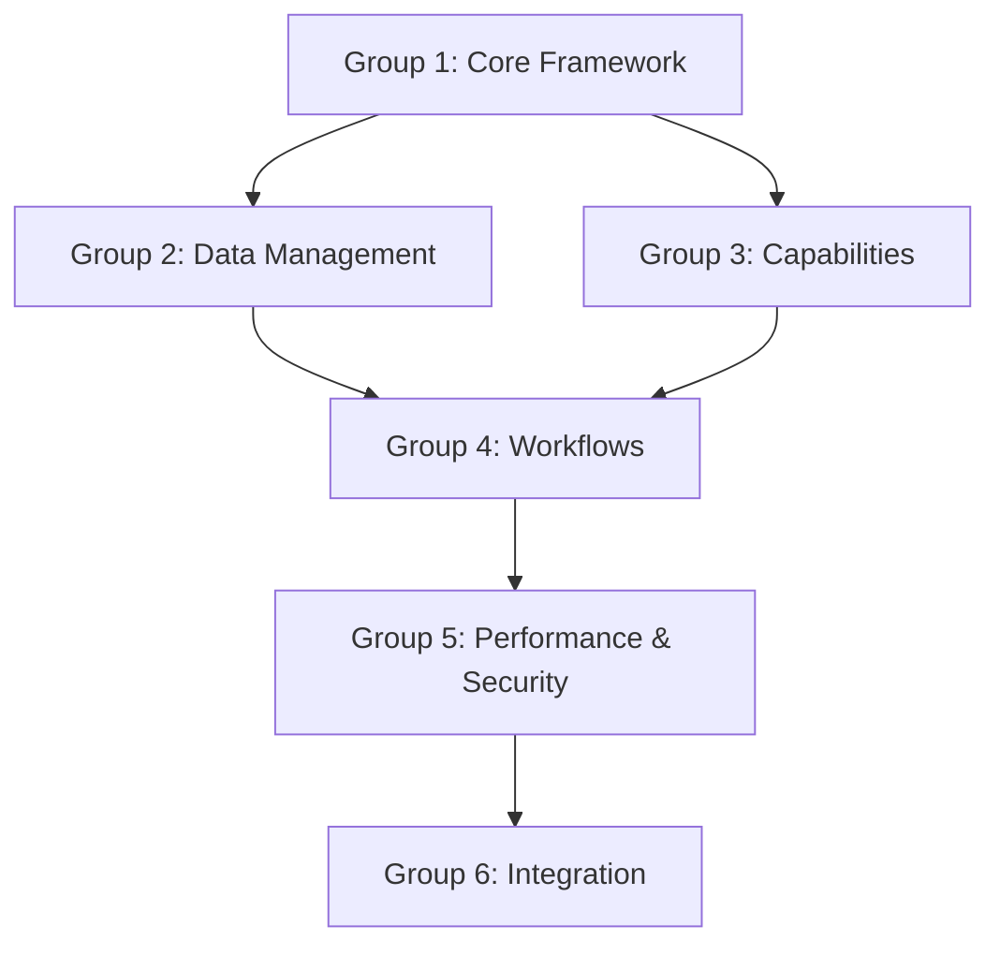

# Test Grouping Analysis

## Test Groups for Batch Processing

### Group 1: Core Agent Framework Tests
**Purpose**: Validate fundamental agent functionality
**Files**:
- test_agents.py (271 lines)
- test_agent_integrator.py (135 lines)
- test_agent_recovery.py (207 lines)

**Key Test Areas**:
- Agent initialization
- State transitions
- Message handling
- Error recovery
- Basic agent interactions

**Dependencies**:
- Knowledge graph basic functionality
- Core agent capabilities

### Group 2: Knowledge Graph & Data Management Tests
**Purpose**: Verify data handling and persistence
**Files**:
- test_knowledge_graph.py (829 lines)
- test_workflow_persistence.py (220 lines)
- test_graph_optimizations.py (154 lines)
- test_graph_monitoring.py (150 lines)
- test_graph_performance.py (168 lines)
- test_remote_graph_manager.py (60 lines)
- test_graphdb_integration.py (123 lines)

**Key Test Areas**:
- Graph operations
- Data persistence
- Query optimization
- Performance monitoring
- Remote graph handling

**Dependencies**:
- Database connectivity
- Graph operations
- Remote access capabilities

### Group 3: Agent Capability & Integration Tests
**Purpose**: Test agent capabilities and integration
**Files**:
- test_capability_management.py (207 lines)
- test_capability_handling.py (176 lines)
- test_integration_management.py (234 lines)
- test_dynamic_agents.py (214 lines)

**Key Test Areas**:
- Capability management
- Agent integration
- Dynamic agent creation
- Role management

**Dependencies**:
- Core agent framework
- Knowledge graph access

### Group 4: Workflow & Process Tests
**Purpose**: Validate workflow and process management
**Files**:
- test_workflow_manager.py (1005 lines)
- test_reasoner.py (116 lines)
- test_consulting_agents.py (361 lines)

**Key Test Areas**:
- Workflow orchestration
- Process management
- Reasoning capabilities
- Consulting agent operations

**Dependencies**:
- Agent framework
- Knowledge graph
- Process management

### Group 5: Performance & Security Tests
**Purpose**: Verify system performance and security
**Files**:
- test_performance.py (233 lines)
- test_security_audit.py (209 lines)
- test_prompt_agent.py (226 lines)

**Key Test Areas**:
- Load testing
- Security validation
- Prompt handling
- Resource usage

**Dependencies**:
- System resources
- Security framework
- Prompt templates

### Group 6: API & Integration Tests
**Purpose**: Test external interfaces and integration
**Files**:
- test_main_api.py (26 lines)
- test_chat_endpoint.py (42 lines)
- test_research_agent.py (292 lines)

**Key Test Areas**:
- API endpoints
- Chat functionality
- Research capabilities
- External integration

**Dependencies**:
- API framework
- External services
- Chat functionality

## Test Execution Strategy

### Phase 1: Core Framework (Group 1)
1. Run basic agent tests
2. Verify agent integration
3. Test recovery mechanisms

### Phase 2: Data Management (Group 2)
1. Test basic graph operations
2. Verify data persistence
3. Check optimization features

### Phase 3: Capabilities (Group 3)
1. Test capability management
2. Verify agent integration
3. Check dynamic agent features

### Phase 4: Workflows (Group 4)
1. Test workflow management
2. Verify process handling
3. Check reasoning capabilities

### Phase 5: Performance & Security (Group 5)
1. Run performance tests
2. Verify security measures
3. Test prompt handling

### Phase 6: Integration (Group 6)
1. Test API endpoints
2. Verify chat functionality
3. Check research capabilities

## Dependencies Between Groups

## Next Steps

1. Create test runner for each group
2. Implement dependency management
3. Add group-specific fixtures
4. Create progress tracking
5. Implement failure recovery

## Success Criteria

1. All groups run independently
2. Dependencies properly managed
3. Clear failure reporting
4. Performance metrics tracked
5. Coverage maintained 